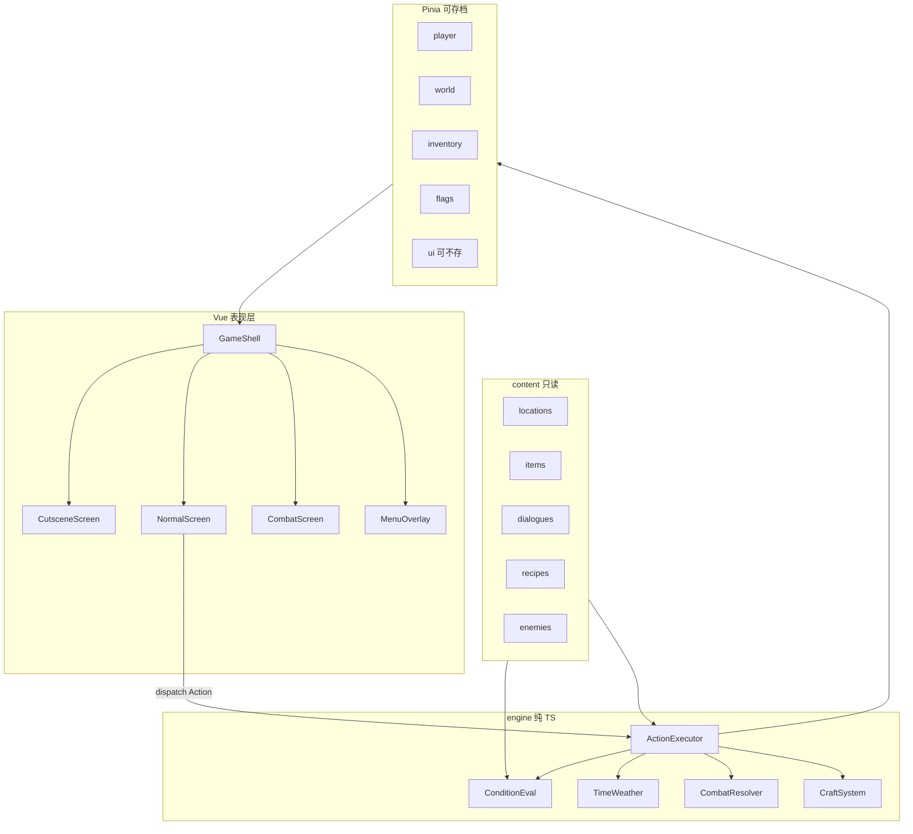
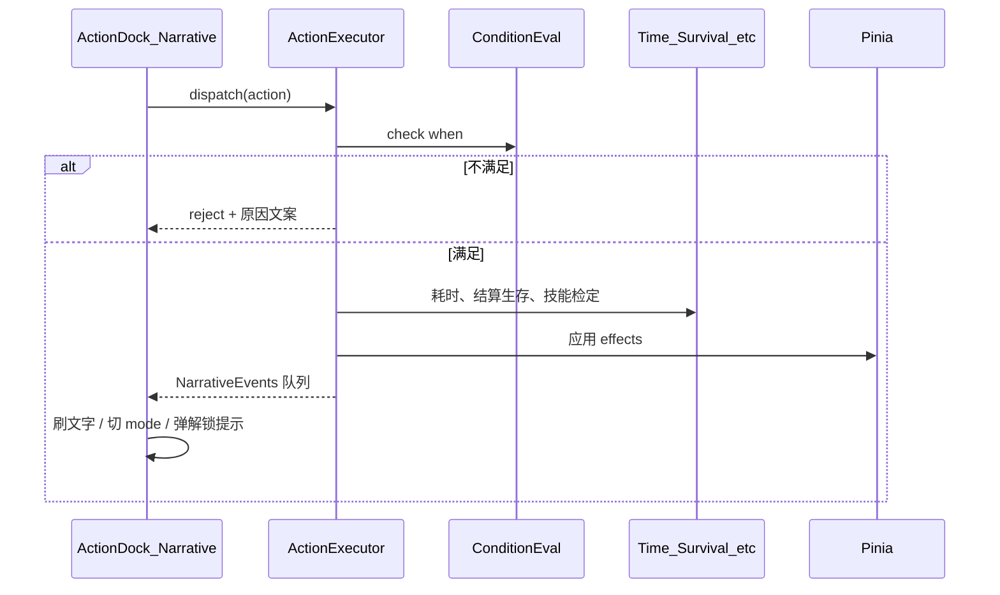

# 蚀岛：程序架构与内容扩展方案

基于现有栈（[package.json](package.json)：Vue 3 / Vite / Pinia / Vue Router / TS），不引入重型框架。游戏逻辑与 Vue 解耦；内容以带类型的数据文件为主，便于后续加地点、对话、配方、敌人。

## 核心原则

1. **内容与逻辑分离**：地点文案、物品、对话、配方、敌人、结局只进 `content/`，引擎只认 `id` 与条件表达式。
2. **运行时与定义分离**：`content` 只读；可存档状态只在 Pinia，序列化到 `localStorage`。
3. **四态画面壳**：过场 / 常态 / 战斗 / 菜单共用一个 `GameShell`，用 `ui.mode` 切换，避免路由爆炸。
4. **动作统一入口**：玩家点击最终变成 `Action`，由引擎校验条件、改状态、推进时间、产出叙事事件，再交给 UI 渲染。



## 目录结构（在现有 `src/` 上扩展）

```
src/
  content/                 # 静态内容（按类型分文件，按 id 引用）
    characters/            # 可选角色与初始加成
    locations/             # 地点、锚点、地牢格子、场景动作
    dialogues/             # 对话树 / 过场脚本
    items/                 # 物品、装备、武器
    recipes/               # 制作蓝图
    enemies/               # 敌人与技能
    events/                # 世界事件、袭击、解锁提示
    endings/               # 结局条件
    texts/                 # 可按 SAN 变体的描述表（可选）
    index.ts               # 汇总注册表 ContentRegistry
  types/
    content.ts             # 内容 schema
    state.ts               # 存档 / 运行时类型
    actions.ts             # Action 联合类型
  engine/                  # 无 Vue 依赖，可单测
    conditions.ts          # flag / attr / skill / san / time / item
    actions/
      executor.ts
      handlers/            # move, talk, explore, craft, fight...
    time.ts
    survival.ts            # HP/饥渴/温暖/SAN 每时结算
    combat.ts
    crafting.ts
    map.ts                 # 大地图解锁与耗时
    dungeon.ts
    san.ts                 # SAN 门槛与不可控行为钩子
    save/
      serialize.ts
      migrate.ts           # 存档版本迁移
  stores/
    player.ts
    world.ts               # 地点、时间、天气、季节、解锁
    inventory.ts
    base.ts                # 基地 / 临时营地 / 埋藏
    combat.ts              # 战斗会话（可进存档或仅内存）
    flags.ts               # 剧情与任务布尔/计数
    ui.ts                  # mode、打开的菜单、待确认结算
    session.ts             # 组合：新游戏 / 读档 / 写档
  screens/
    TitleScreen.vue
    CharacterSelect.vue
    GameShell.vue          # 按 ui.mode 挂载子画面
    CutsceneScreen.vue
    NormalScreen.vue
    CombatScreen.vue
    EndingScreen.vue
  components/
    StatusBar.vue          # 顶栏：生存属性 + 日期时间
    SceneImage.vue
    NarrativePanel.vue     # 中间文字 + 可交互 span
    ActionDock.vue         # 底栏：系统按钮 | 场景按钮 / 交互选项
    menus/                 # 系统 / 背包 / 属性
  composables/
    useGameDispatch.ts
    useInteractiveText.ts
  assets/game/             # 场景图、UI 图（按 id 命名）
```

路由只保留少数顶层页：`/` 标题、`/play` 游戏壳、`/ending/:id`。画面模式不走路由。

脚手架里的 `HelloWorld` / `AboutView` / `counter` 可逐步删掉，不参与游戏架构。

## 数据如何存储

### 1. 静态内容（开发时编辑、构建时打包）

采用 **TypeScript 模块导出对象**（不是裸 JSON）：改字段有类型提示，引用 `as const` + 满足 `LocationDef` 等接口；Vite 仍会 tree-shake。单文件过大时再拆，例如 `locations/beach.ts`、`locations/cave.ts`。

内容统一用字符串 `id` 互相关联，禁止在引擎里写死中文地点名。

示例形状（概念）：

```ts
// content/locations/beach.ts
export const beach: LocationDef = {
  id: 'beach',
  name: '坠毁海滩',
  image: 'beach',
  description: { default: '……', sanBelow: [{ max: 30, text: '……' }] },
  exits: [{ to: 'wreck', travelMinutes: 20, unlockFlag: 'know_wreck' }],
  actions: [
    { id: 'explore', label: '探索', type: 'explore', timeCost: 30 },
    {
      id: 'enter_cave',
      label: '进入洞窟',
      type: 'enterDungeon',
      dungeonId: 'beach_cave',
      when: { flag: 'cave_found' },
    },
  ],
  interactables: [
    {
      id: 'fuselage',
      label: '机身残骸',
      type: 'examine',
      textKey: 'beach.fuselage',
    },
  ],
}
```

对话 / 过场用 **节点图**：

```ts
{ id: 'intro', nodes: [
  { id: 'n1', text: '你在沙滩醒来。', next: 'n2' },
  { id: 'n2', text: '不远处是飞机残骸。', choices: [
    { label: '走向残骸', next: 'n3', effects: [{ type: 'setFlag', flag: 'know_wreck' }] },
  ]},
]}
```

`ContentRegistry` 在启动时把所有模块收成 `Record<Id, Def>`，引擎只查 registry。

### 2. 条件与效果 DSL（扩展内容的关键钥匙）

所有「何时显示 / 能否做 / 做完改什么」走同一套小语言，避免每个系统各写一套 if：

- **When**：`flag` / `notFlag` / `attrGte` / `skillGte` / `sanIn` / `hasItem` / `timePhase` / `all` / `any`
- **Effect**：`setFlag` / `addItem` / `removeItem` / `modAttr` / `modSan` / `unlockLocation` / `startCombat` / `startDialogue` / `advanceTime` / `grantXp`

新内容优先堆数据 + when/effects，而不是改 Vue。

### 3. 运行时状态（可存档）

Pinia 中只放可序列化快照，例如：

| Store       | 主要内容                                                   |
| ----------- | ---------------------------------------------------------- |
| `player`    | 角色 id、生存属性、基础属性、技能熟练度、装备槽、感染/状态 |
| `world`     | 当前地点、已解锁地点、日历（日/季节/时段）、天气、地牢坐标 |
| `inventory` | 背包堆叠、负重                                             |
| `base`      | 各基地建筑、仓储、临时营地倒计时、埋藏点                   |
| `flags`     | 剧情/任务/线索计数                                         |
| `combat`    | 当前战斗回合、敌我 CD、日志（战斗中）                      |
| `ui`        | `mode`、打开菜单、结算弹层（默认不写档或写最小集）         |

存档格式：

```ts
{ version: 1, savedAt, slot, snapshot: { player, world, inventory, base, flags } }
```

- 多槽位：`localStorage` key `erosion-island-slot-N`
- `migrate.ts`：升 `version` 时补默认字段，保证改 schema 不炸旧档
- 地牢内按设计限制存档：在 `session.save` 里读 `world.inDungeon` 拦截

### 4. 表现层如何实现（手机优先 H5）

`GameShell.vue` 固定三区布局（与设计文档对齐）：

| 区域 | 常态                                            | 战斗                             | 过场                     |
| ---- | ----------------------------------------------- | -------------------------------- | ------------------------ |
| 顶   | `StatusBar`                                     | 玩家条 + 敌人条                  | 无或极简                 |
| 中   | 场景图 + `NarrativePanel`                       | 战斗描述日志                     | 居中文字，点任意处下一段 |
| 底   | `ActionDock`：左系统 / 右场景；交互中整栏变选项 | 攻击/技能/逃跑（与结算按钮错位） | 仅有选择时出按钮         |

实现要点：

- **可交互文本**：`NarrativePanel` 解析轻量标记，如 `[[fuselage|机身残骸]]`，渲染为带下划线的按钮/span，点击 `dispatch({ type:'examine', targetId })`。
- **SAN 表现**：`san.ts` + computed 提供 `uiTheme`、描述变体；低 SAN 时过滤 `when.sanIn` 选项，并可能插入强制 `Action`。
- **战斗结算**：`ui.mode = 'combat_result'` 独立一层，按钮位置与战斗操作区分开，必须确认才回 `normal`。
- **样式**：`assets` + CSS 变量（时段/SAN 换肤），布局用 rem/vh + 安全区，默认竖屏操作区拇指可达。

不在首期引入独立剧情编辑器；用 TS 内容文件 + 类型即编辑体验。

## 引擎关键循环



任意系统（钓鱼加成、夜间移速、基地袭击）都挂在「推进时间」或「进入时段」钩子上，而不是散落在组件里。

## 便于更新与加内容的约定

1. **加地点**：新建 `content/locations/xxx.ts` → 挂到 `index.ts` → 配 `exits` / `actions` / 解锁 `effects`。
2. **加对话/任务**：加 dialogue 节点 + `flags`；选项用 `when` 控制；奖励用 `effects`。
3. **加物品/配方**：`items` + `recipes`（蓝图 flag、工作台 buildingId、技能/智力门槛、耗时、材料）。
4. **加敌人**：`enemies` + 地点/事件 `startCombat`；技能含 CD、伤害公式引用属性 id。
5. **加结局**：`endings` 里写 `when`；引擎在关键检查点（离开岛、首领战、引爆等）调用 `checkEndings()`。
6. **禁止**：在 `.vue` 里写剧情分支；在 handler 里写死某个地点的特殊 if（极少数系统级例外进 `engine/hooks` 并文档化）。

## 建议落地顺序（批准后按此实现）

| 阶段 | 交付                                                                    | 证明架构可用                 |
| ---- | ----------------------------------------------------------------------- | ---------------------------- |
| P0   | 目录骨架、`types`、`ContentRegistry`、空 `GameShell` 四态切换、存档读写 | 标题 → 选角 → 进游戏 → 存读  |
| P1   | 过场 intro + 常态海滩 + 状态栏 + 时间流逝 + 生存结算                    | 醒来、点残骸、时间/饥渴变化  |
| P2   | 大地图移动、地点解锁提示、简单探索                                      | 海滩 ↔ 残骸                  |
| P3   | 背包/属性菜单、制作最小环                                               | 捡物 → 做简易工具            |
| P4   | 战斗 + 结算错位确认                                                     | 一场教程战                   |
| P5   | 基地/临时营地、地牢移动限制存档                                         | 扎营睡觉                     |
| P6   | SAN 变体文案与选项过滤、结局检查                                        | 一条低 SAN 分支 + 一个假结局 |

P0–P1 即可验证「数据驱动 + 动作管道 + 存档」；后续内容主要加 `content/`。

## 技术默认（已选定）

- 内容：**TS 模块 + 接口约束**（不用 YAML/远程 CMS）
- 状态：**Pinia + localStorage 多槽**，带 `version` 迁移
- 画面：**单壳多 mode**，Router 只管标题/游戏/结局
- 逻辑：`**src/engine` 纯函数/类\*\*，Vue 只 dispatch 与订阅 store
- 检定：技能/属性检定集中在 engine，公式配置化（如战斗技能等级表）

## 首批会动到的现有文件

- [src/main.ts](src/main.ts)、[src/App.vue](src/App.vue)：去掉欢迎页壳，挂游戏路由
- [src/router/index.ts](src/router/index.ts)：改为 Title / Play / Ending
- [src/stores/counter.ts](src/stores/counter.ts)：删除，换游戏 stores
- [index.html](index.html)：标题改为「蚀岛」，强化移动端 viewport / theme-color
